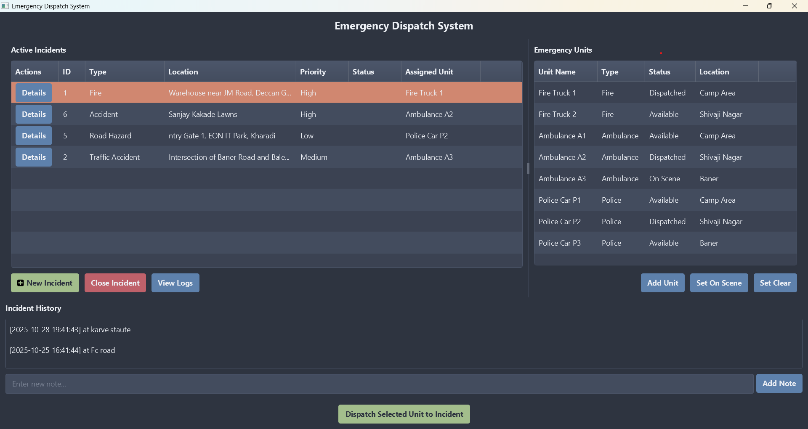
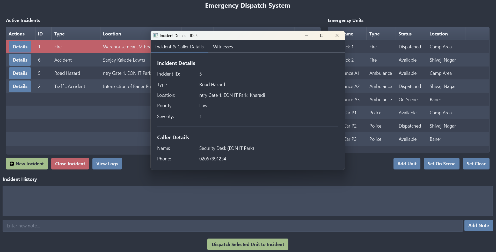
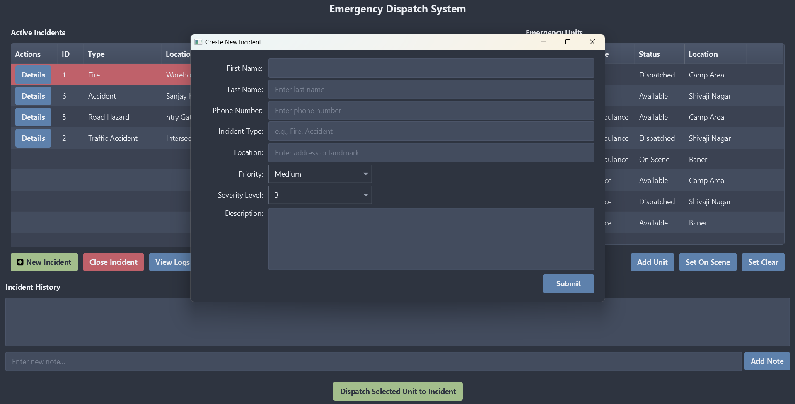

# Emergency Dispatch System 🚨

**An advanced, real-time JavaFX dashboard for managing critical incidents and dispatching emergency units.**

<p align="center">
  
  
  
  
</p>

> This 2-tier application provides a complete solution for a dispatch center, featuring a live-updating dashboard, detailed incident management, and a robust logging system.


## ✨ Core Features

* **Real-Time Dashboard:** The main dashboard automatically refreshes every 5 seconds, showing live updates to active incidents and unit statuses.
* **Incident Management:**
    * **Create:** A detailed pop-up form to create new incidents with type, location, priority, and witness details.
    * **Dispatch:** Assign any "Available" unit to a selected incident with a single click.
    * **Close:** Resolve an incident, which automatically updates the incident status and frees up the assigned unit.
* **Unit Management:**
    * **Create:** Add new emergency units (Fire, Police, Ambulance) to the system, including their starting location.
    * **Update Status:** Manually set a unit's status to "On Scene" or "Available" ("Set Clear").
    * **View all units,** their current status, and their assigned location.
* **Detailed Incident View:**
    * **Open a detailed, tabbed window** for any incident by clicking the "Details" button.
    * **View comprehensive caller information.**
    * **View a list of all witnesses** for the incident.
    * **Add or delete witnesses** in real-time.
* **Auditing & Logs:**
    * **View Logs:** Open a "Logs" window for any selected incident to see its complete status change history, location history, and all associated unit logs.
    * **Add Notes:** Add new timestamped notes to an incident's location history in real-time.
* **Professional UI:**
    * Styled with the modern **AtlantaFX (Nord Dark)** theme.
    * **Custom CSS** for high-priority incidents (highlighted in red).
    * **Icons on buttons** for a clearer user experience.

## 🖼️ Gallery


| Main Dashboard | Incident Details | New Incident Form |
| :---: | :---: | :---: |
|  |  |  |

---

## 🛠️ Tech Stack

* **Core:** Java (JDK 25)
* **Frontend (UI):** JavaFX
* **Database:** MySQL
* **Connectivity:** JDBC
* **Build & Dependency Management:** Apache Maven
* **UI Theme:** AtlantaFX
* **Icons:** FontAwesomeFX

---

## Database Setup

1.  **Database:** `emergency_dispatch_system`
2.  **User:** `dispatch_app` (requires `ALL PRIVILEGES` on the database).
3.  **Tables:** The system relies on 13 tables, including `Incidents`, `Emergency_Units`, `Callers`, `Locations`, and `Dispatches`.
4.  **Stored Procedures:** All business logic is handled by MySQL Stored Procedures, including:
    * `CreateNewIncident`
    * `CloseIncident`
    * `DispatchUnitToIncident`
    * `CreateNewUnit`
    * `UpdateUnitStatus`
    * `AddWitness`
    * `DeleteWitness`
    * `AddLocationHistoryNote`

---

## 🚀 How to Run

### Prerequisites

* Java JDK 25 (or as specified in `pom.xml`)
* Apache Maven
* A running MySQL server with the `emergency_dispatch_system` database and procedures set up.

### 1. Configure Connection

Update the database credentials in `src/main/java/com/emergency/util/DatabaseConnector.java`.

### 2. Configure Run Arguments

This project uses the Java Module System and may require VM arguments to run. Make sure these are set in your `pom.xml` (under `javafx-maven-plugin`) or your IDE's run configuration if you see warnings:

```xml
<options>
    <option>--enable-native-access=javafx.graphics</option>
</options>
```
### Future Scope
This project is a strong foundation. Future innovative steps could include:

 1.Live Map Integration: Integrate a map (like Gluon Maps) to plot incident locations and unit paths.

 2.User Authentication: Add a login screen with different roles (e.g., Dispatcher, Supervisor).

 3.Advanced Analytics: A separate "Reporting" tab to show charts of incident types, average response times, and unit activity.

 4.Smart Suggestions: Automatically suggest the closest available unit for a new incident.
